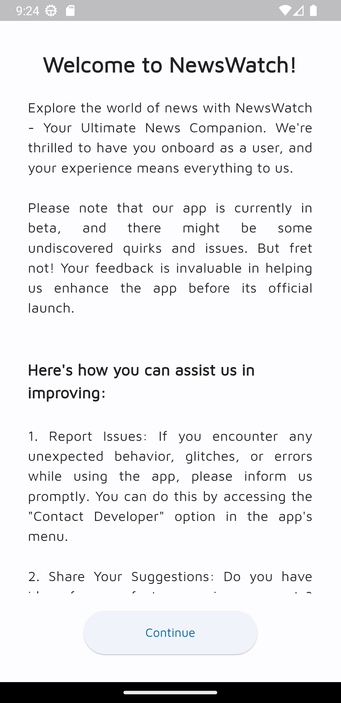
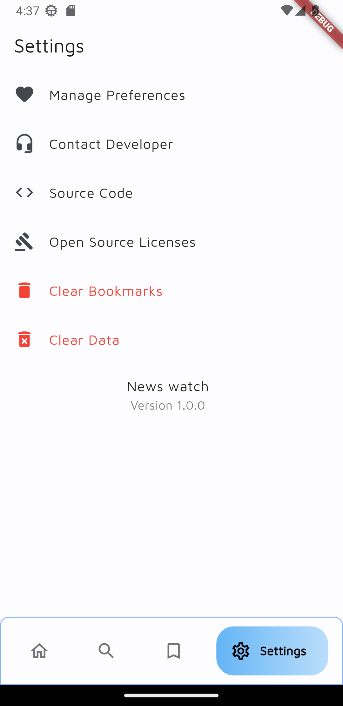

# Flutter News App with Bing News Web Scraping

[](https://github.com/sreeram3927/flutter_news_app/stargazers)
[](https://github.com/sreeram3927/flutter_news_app/network/members)
[](https://github.com/sreeram3927/flutter_news_app/issues)
[](LICENSE)


### App Preview


## Overview

Welcome to the Flutter News App with Bing News Web Scraping! This open-source project empowers you to create a powerful and customizable news application for your audience. By leveraging Flutter for the frontend and web scraping to fetch real-time news data from Bing News, this app provides an efficient and engaging news browsing experience.

## Features

- **Web Scraping**: Utilizes web scraping techniques to fetch the latest news articles from Bing News.
- **Flutter Framework**: Built with Flutter, a robust and cross-platform UI toolkit, ensuring a consistent user experience across iOS and Android devices.
- **User-Friendly Interface**: A clean and intuitive interface to browse, search, and read news articles effortlessly..
- **Effortless sharing**: Share intriguing articles with friends, family, and colleagues effortlessly, spreading knowledge and information with ease.
- **Bookmark news**: Seamlessly save your favorite news for quick and convenient access at any time.
- **Search Functionality**: Find specific news articles quickly with a powerful search feature.

## Getting Started

1. **Clone the Repository**:

   ```bash
   git clone https://github.com/sreeram3927/flutter_news_app.git
   ```

2. **Navigate to the Project Directory**

    ```bash
    cd flutter_news_app
    ```

3. **Install Dependencies**

    ```bash
    flutter pub get
    ```

4. **Run the app**

    ```bash
    flutter run
    ```

## Contributing

We welcome contributions from the community! Whether you're interested in fixing bugs, adding new features, or improving documentation, please feel free to open issues and pull requests.

## License

This project is under the [MIT License](https://github.com/sreeram3927/flutter_news_app/blob/main/LICENSE).

## Screenshots

### Onboarding Pages

 

### Home Page

  

### Search Page

 

### Bookmarks Page


### Settings Page

 

### Favourite Page


### News Card Widget


### Loading Screens

 


## Contact

If you have any queston, suggestion, or feedback, feel free to reach out to me.

Github: [sreeram3927](https://github.com/Sreeram3927)

LinkedIn: [/in/sreeram3927](https://linkedin.com/in/Sreeram3927)

X: [sreeram3927](https://twitter.com/sreeram3927)
